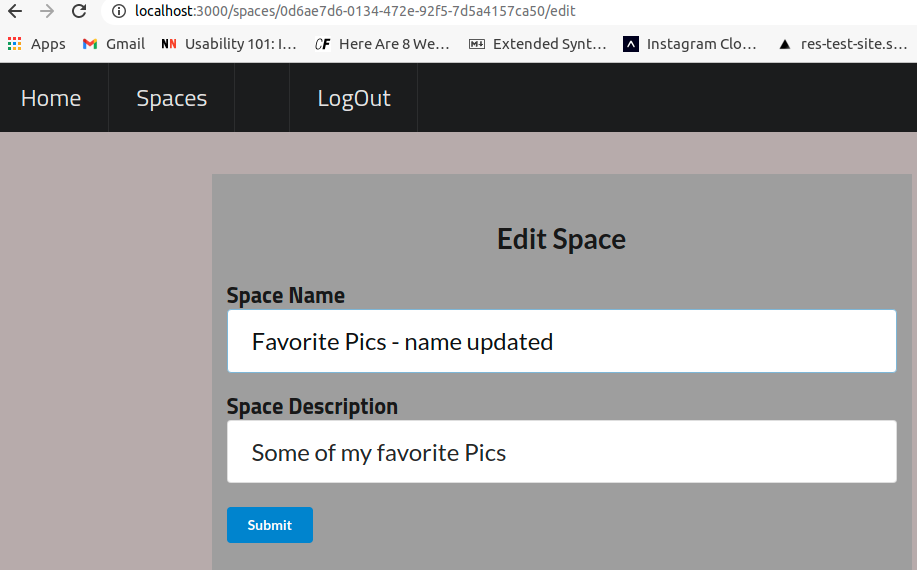
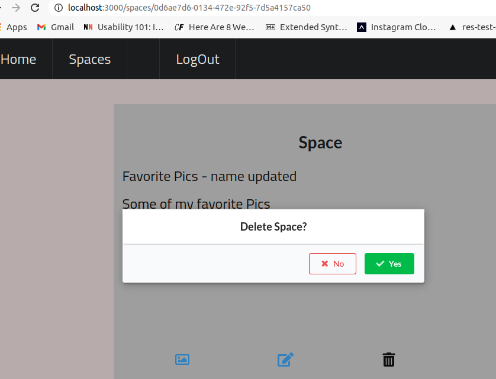

# Serverless Capstone App For Udac Cloud Developer

## Objective

Demonstrate knowledge and proficiency building a serverless application, which uses the AWS services: API-Gateway, Lambda, DynamoDb. In addition, it uses Auth0 for authentication, REST API, React, React-Router and Semantic UI.

This configuration provides a near zero $ fixed cost as there are no servers acquisitioned and Lambda and DynamoDb are serverless(PAAS). The only fixed recurring cost is the S3 storage used for storing the pictures that are uploaded. The deployment is also uploaded to S3, but its cost is neglible.

## Quick Start

The assumption is that Node, NPM and a visual editor, such as Visual Studio, are already installed on the machine.

### Install the Serverless Framework

Install the Serverless Framework on your machine.

```
npm i -g serverless
```

### Replicate this code to your PC

```
git clone <thisRepository>
```

### Start the Back-end

The back-end may still be working that was deployed initially for this project, but is not guarantted. To deploy it to your own infrastructure you need to perform the following.

#### Add your AWS credentials

Then, add your AWS credentials in the `.env` file in the root directory, like this:

```text
AWS_ACCESS_KEY_ID=SDADSADADADASDADA
AWS_SECRET_ACCESS_KEY=ASDASDASDASDASDAD
```

#### Deploy the back-end

The back-end deployment requires deploying: DynamoDb, S3 and Lambda. The Lamda portion will include API Gateway.

```sh
# Dynamo Db
cd <directoryCodeIsClonedTo>/api-users/infrastructure/db
serverless deploy

# S3
cd <directoryCodeIsClonedTo>/api-users/infrastructure/s3
serverless deploy

# Lambda
cd <directoryCodeIsClonedTo>/api-users
serverless deploy
```

### The front-end

To setup the front-end, a single page javascript web application in Auth0 needs to be created. _Note_ Don't choose React from the Auth0 app types.

Get the domain and clientID information from this setup.

#### config.js

In the root folder of the project,

\*<directoryCodeIsClonedTo>/site/src/config.js

The contents of config.js should be:

```js
// AWS Information
const apiId = "asdadada" /
const awsRegion = "us-east-1"
export const apiEndpoint = `https://${apiId}.execute-api.${awsRegion}.amazonaws.com/dev`

// Auth0 Information
export const authConfig = {
	domain: "dev-523423qad.us.auth0.com", // Auth0 domain
	clientId: "asdadsadadasd", // Auth0 client id
	callbackUrl: "http://localhost:3000/callback",
}
```

#### Start the Front-end

```sh
# Dynamo Db
cd <directoryCodeIsClonedTo>/site
npm install
npm start
```

## Project Structure Strategy

The code was split into the back-end code(api-spaces) and the front-end code(site). The back-end code was further split into the lambda code, s3 and dynamodb. The reason for this split is the db structure is more stable and incurs less frequent change. The Lambda code changes much more frequently.In addition, deploying the changes using Serverless to DynamoDb is not as reliable because of issues with the delete potentially hindering the deploy, which has been experienced.

## Project Structure - Severless.yml

Below are the locations of the serverless.yml files, which specificy the configuration for the infrastructure and code deployment.

```
- api-spaces: back-end aws code: lambda, dynamodb, S3
  - infrastructure
    - db: Dynamo Db structure
    - s3: S3 config
- site: front-end web application code
```

## Project Structure - code location -

### Back-end

- api-spaces: back-end code: aws lambda

Dataflows from:

- lambda/http ->
- businessLogic ->
- datalayer & return back up the chain

_Note:_ The authorization occurs first for all events

### Front-end

The front-end code is located at /src. The front-end code is split into:

- api: the api calls to the back-end are made here
- auth: authorization code
- components: code used across the pages. E.g AppMenu
- pages: contains the App pages
- App.js - contains the routing via React Router.

- src: front-end code

## Different Coding Styles

- There are different coding styles utilized to show the mulitple ways things can be done with React/JS/TS. For example, the page _Space_ is a pure component and uses _useEffect_. _CreateSpace_ is a react compoment and uses the lifecycle stages _componentDidMount_. Understanding the different ways to achieve a goal is important, even though one is preferred over the other, various methods will be seen in the wild at different organizations.

## Issues Encountered & Solutions

### Uploading Image Authorization Error

Made the below change in the back-end source code for the problem described on the Stackoverflow articles below.

const s3 = new XAWS.S3({
signatureVersion: "v4",
region: "us-west-2",
})

Source:
[StackOverflow: Why uploading image to s3 give me AuthorizationQuery error? ](https://stackoverflow.com/questions/51824276/why-uploading-image-to-s3-give-me-authorizationquery-error)

[StackOverflow: Unable to upload files to my S3 bucket](https://stackoverflow.com/questions/50312184/unable-to-upload-files-to-my-s3-bucket)

### Export default withRouter

_Error received_
typescript export default withRouter is not assignable to parameter of type 'ComponentType<RouteComponentProps<any, StaticContext, unknown>>'\*

_Solution_
https://stackoverflow.com/questions/56979012/issue-with-types-when-using-withrouter-and-typescript

## Starter Code Based On

[](https://www.serverless-fullstack-app.com)

A complete, serverless, full-stack application built on AWS Lambda, AWS HTTP API, Express.js, React and DynamoDB.

## Other Resources

For more details on each part of this fullstack application, check out these resources:

- [Serverless Components](https://github.com/serverless/components)
- [Serverless Express](https://github.com/serverless-components/express)
- [Serverless Website](https://github.com/serverless-components/website)
- [Serverless AWS DynamoDB](https://github.com/serverless-components/aws-dynamodb)
- [Serverless AWS IAM Role](https://github.com/serverless-components/aws-iam-role)

## Guides

### How To Debug CORS Errors

If you are running into CORS errors, see our guide on debugging them [within the Express Component's repo](https://github.com/serverless-components/express/blob/master/README.md#how-to-debug-cors-errors)

## Screenshots of Application

Homescreen


Auth0 Login via App


Post Login


Menu


Create Space


Spaces


Space


Pic Upload


Edit Space


DynamoDb Spaces Tables


DynamoDb Images Tables



